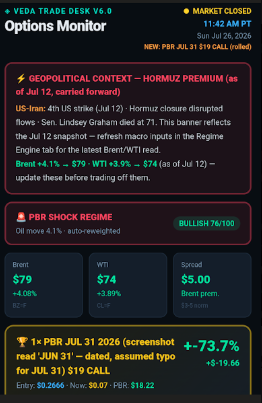
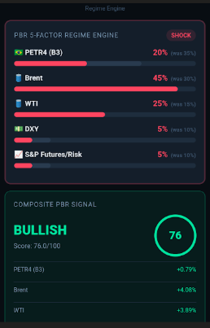
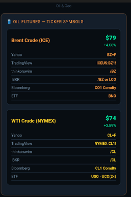
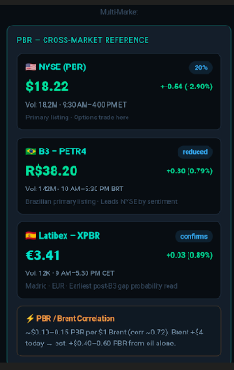
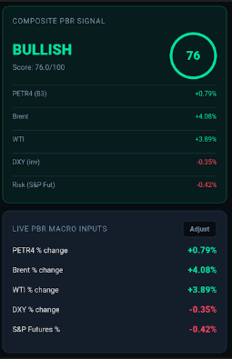

# VEDA Decision Support Platform

Independent software engineering project demonstrating decision-support architecture, multi-source data integration, predictive analytics, and operator-focused interface design.

> Source code is intentionally private while the project remains under active development. This repository showcases functionality and engineering approach through documentation and application screenshots.

## Overview

VEDA Trade Desk is an independent engineering project that I designed and developed to explore complex decision-support systems, predictive analytics, and multi-source data integration.

Rather than functioning as a traditional trading application, the platform serves as a real-time analytics environment that combines multiple global data sources into a unified operational dashboard.

The platform combines financial market data, macroeconomic indicators, geopolitical events, and custom scoring models into a single operator interface designed to support rapid decision making under uncertainty.

The project was built through continuous iteration, experimentation, and validation, evolving from a simple dashboard into a modular software platform emphasizing systems engineering, visualization, and operator-focused design.

---

# Engineering Goals

- Build a modular decision-support platform
- Design an operator-first interface
- Integrate multiple independent market signals
- Develop adaptive scoring algorithms
- Model changing market regimes
- Improve decision making through visualization
- Practice rapid software iteration
- Validate engineering assumptions through testing

---

# Platform Features

- Multi-market monitoring
- Cross-market correlation engine
- Brent / WTI analytics
- Petrobras (PBR) monitoring
- Geopolitical event tracking
- Adaptive regime detection
- Weighted scoring engine
- Interactive dashboards
- Historical performance tracking
- Decision-support visualization
- Modular React architecture
- Responsive mobile interface

---

# Technologies

- React
- JavaScript
- JSX
- Recharts
- CSS
- Data Visualization
- Systems Engineering
- Predictive Analytics
- Decision Modeling

---

# Development Philosophy

This project represents hundreds of hours of independent engineering work.

Every version was developed to solve limitations discovered in previous iterations through structured experimentation, continuous testing, and rapid design improvements.

Rather than optimizing for academic exercises, the project emphasizes practical engineering, operator usability, modular architecture, and fast decision support.

The underlying implementation remains private because it represents active independent engineering work.

The screenshots below demonstrate the functionality and engineering approach without exposing proprietary source code.

---

# Dashboard Overview

Main operational dashboard integrating market conditions, geopolitical context, and adaptive trade monitoring.

---

# Regime Detection Engine

Composite scoring engine dynamically adjusting weighting across multiple market inputs.

---

# Brent Correlation Analysis

Visualization modeling the relationship between Brent crude price movement and Petrobras valuation.

---

# Multi-Market Reference

Cross-market monitoring integrating NYSE, B3, and European listings alongside commodity relationships.

---

# Oil Reference Module

Reference interface mapping commodity tickers across major trading platforms.

---

# DEMO - PD
A simplified, portfolio-safe code demo of this architecture is available at 
github.com/PVEDA/DYNAMIC-DECISION-DEMO

# Current Status

Active Development

New analytical capabilities, visualization improvements, and decision-support features continue to be added as the platform evolves.
